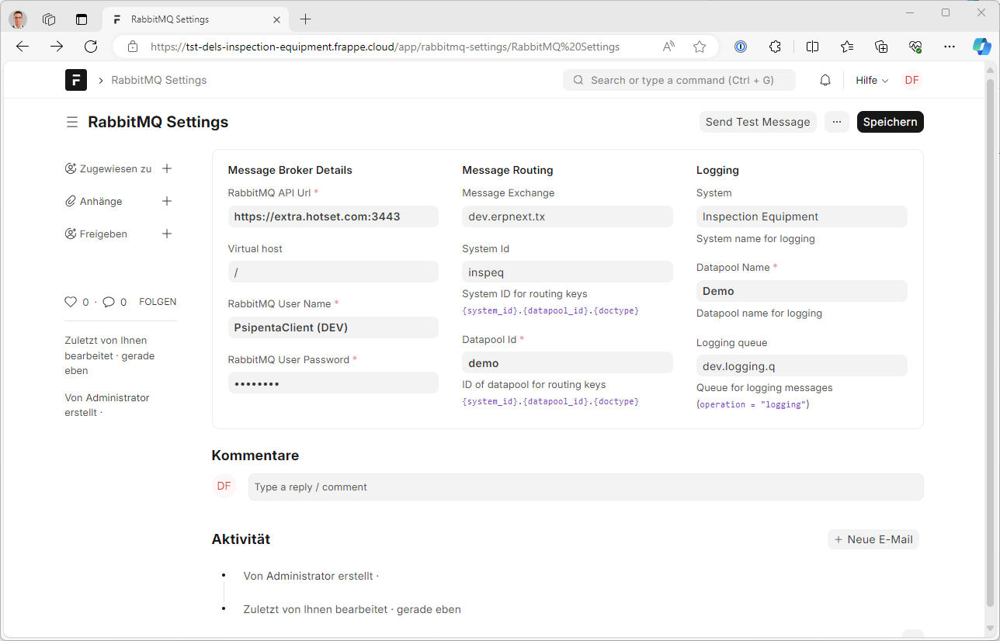

# RabbitMQ Settings

Mit diesem Doctype werden die notwendigen Einstellungen für das Senden von Nachrichten vorgenommen:

| Feld                      | Bedeutung                                                                |
|---------------------------|--------------------------------------------------------------------------|
| **RabbitMQ API Url**      | URL, unter der die HTTP-API von RabbitMQ erreichbar ist                  |
| **Virtual host**          | Virtueller AMQP-Host. Bei Hotset normalerweise `"/"`                     |
| **RabbitMQ User Name**    | Benutzername für die Anmeldung an RabbitMQ                               |
| **RabitMQ User Password** | Password für die Anmeldung an RabbitMQ                                   |
| **Message Exchange**      | Message Exchange, an die Nachrichten gesendet werden sollen              |
| **System Id**             | System ID, die für die Routing-Keys verwendet werden soll                |
| **Datapool Id**           | Kürzel des Datenbereichs, das für die Routing-Keys verwendet soll        |
| **System**                | Bezeichnung des Systems, die in *Logeinträgen* protokolliert werden soll |
| **Datapool Name**         | Name des Datenbereichs, der in *Logeinträgen* protokolliert werden soll  |
| **Logging queue**         | Messagequeue, an die die *Logmeldungen* geschickt werden sollen          |

## Testnachricht senden

Mit dem Button *Send Test Message* kann man, nachdem die Einstellungen abgespeichert sind, überprüfen, ob eine Nachricht an den Messagebroker gesendet werden konnte.

Das Ergebnis und mögliche Fehler werden in einer Messagebox angezeigt. Außerdem muss im Log dann die Meldung `"RabbitMQ settings are configured correctly."` erscheinen.

