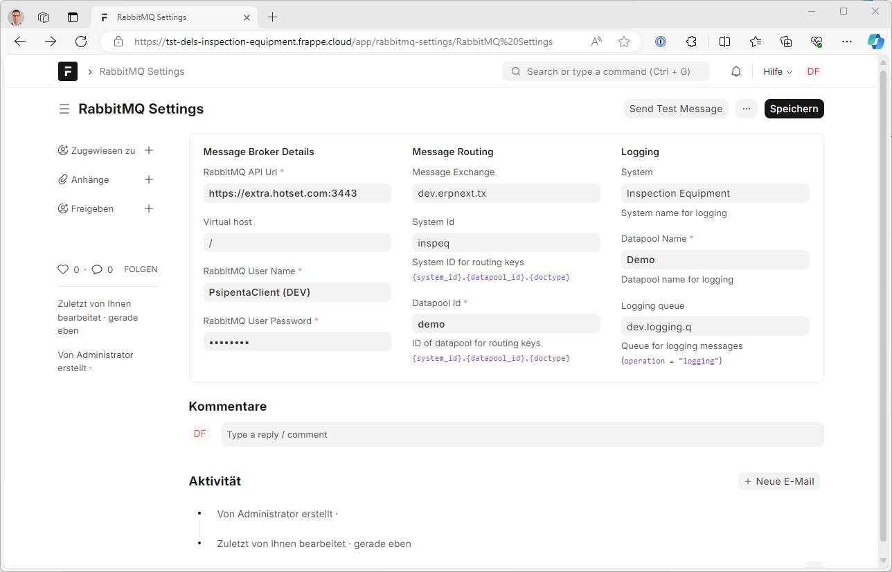

# RabbitMQ Settings

This Doctype is used to configure the necessary settings for sending messages:

| Field                      | Description                                                             |
|---------------------------|--------------------------------------------------------------------------|
| **RabbitMQ API Url**      | URL where the HTTP API of RabbitMQ is reachable                         |
| **Virtual host**          | Virtual AMQP host. Usually `"/"` for Hotset                            |
| **RabbitMQ User Name**    | Username for logging in to RabbitMQ                                    |
| **RabitMQ User Password** | Password for logging in to RabbitMQ                                    |
| **Message Exchange**      | Message Exchange to which messages should be sent                       |
| **System Id**             | System ID to be used for routing keys                                   |
| **Datapool Id**           | Abbreviation of the datapool to be used for routing keys                |
| **System**                | Name of the system to be logged in *log entries*                        |
| **Datapool Name**         | Name of the datapool to be logged in *log entries*                      |
| **Logging queue**         | Message queue where *log messages* should be sent                       |

## Send Test Message

The *Send Test Message* button allows you to verify if a message could be sent to the message broker after saving the settings.

The result and any possible errors will be displayed in a message box. Additionally, the log should show the message `"RabbitMQ settings are configured correctly."`.

